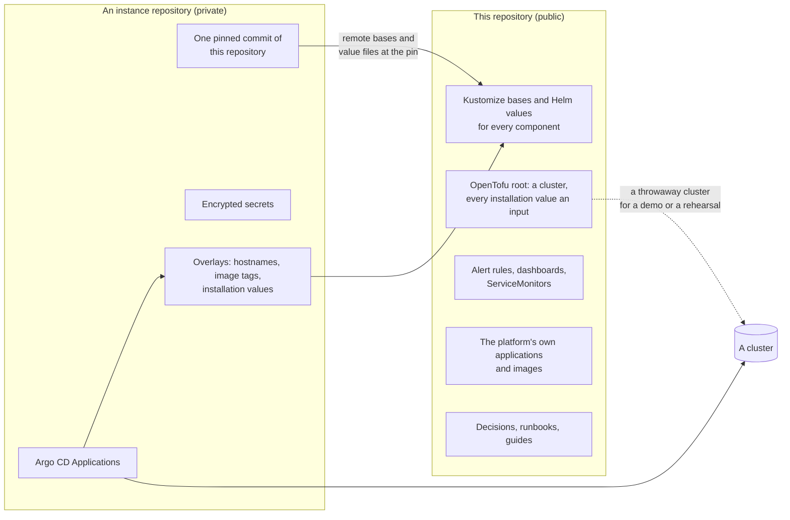
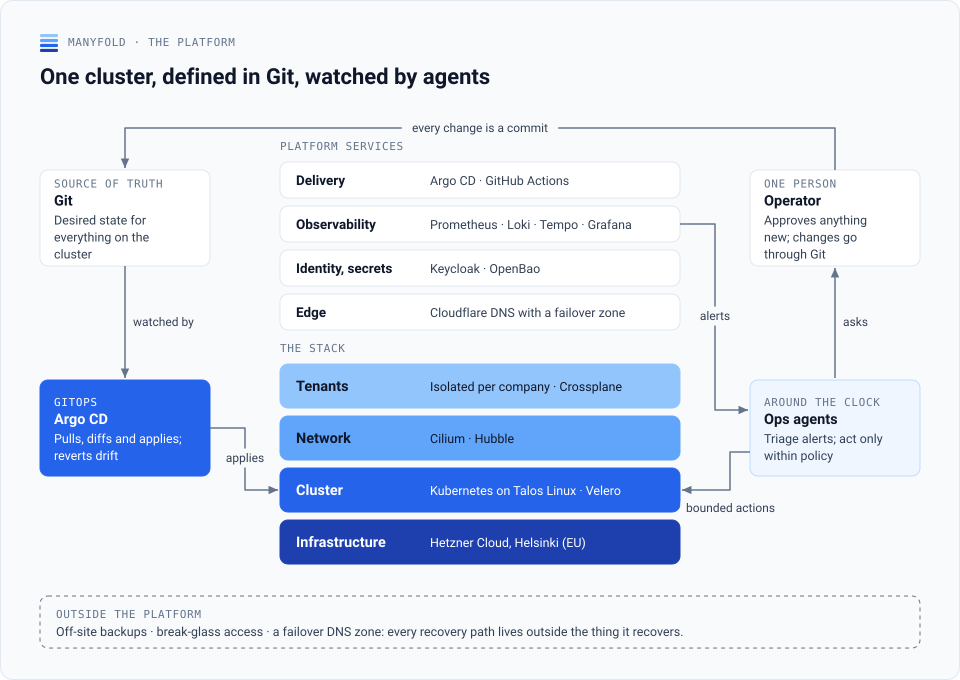
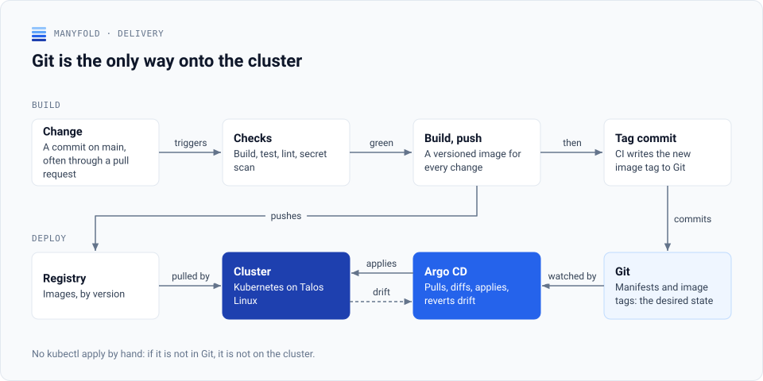
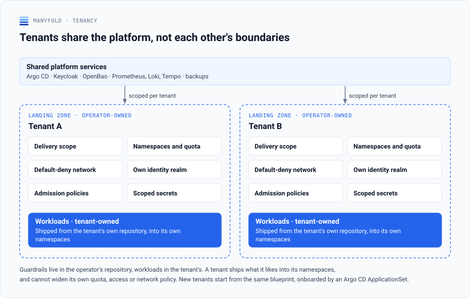

  

# Manyfold platform

The reference installation of a small production Kubernetes platform on European
infrastructure: Talos Linux on Hetzner Cloud, Cilium, Argo CD, Crossplane, OpenBao, Keycloak and
the Grafana observability stack, delivered from Git and run by one operator with agents on first
line. This repository holds everything about that platform that is not specific to one
installation. Apache-2.0.

## Table of contents

- [What this repository is](#what-this-repository-is)
- [The platform](#the-platform)
- [How a change reaches a cluster](#how-a-change-reaches-a-cluster)
- [Tenancy](#tenancy)
- [What is here](#what-is-here)
- [Technology](#technology)
- [Working in this repository](#working-in-this-repository)
- [Decisions](#decisions)
- [Licence](#licence)

## What this repository is

Two repositories describe one platform. This one, public, holds the generic half: Kubernetes
bases and Helm values for every component, the OpenTofu root that bootstraps a cluster, the
platform's own Kubernetes APIs, alert rules, dashboards, the applications the platform runs for
itself, and the tooling and documents around them. A private **instance repository** holds what
is specific to one installation: hostnames, secrets, image tags and the Argo CD Applications
that deploy it. The instance reads this repository at one pinned commit, so a merge here changes
what an installation *can* pin and deploys nothing by itself.

It is a reference installation, not a runnable demo tree: there is no Application set to point a
cluster at. What it offers is a complete, reviewed picture of how such a platform is put
together, ready to read, to adopt in parts, or to bring up as a throwaway cluster from the
OpenTofu root and the bases. The split and its rules are
[ADR-0054](docs/adr/0054-public-platform-and-private-instance-repositories.md).

## The platform

<picture>
  <source media="(prefers-color-scheme: dark)" srcset="docs/architecture/diagrams/platform-dark.svg">
  
</picture>

Git is the source of truth and Argo CD applies it; nothing reaches a cluster any other way. The
stack under it has four layers, each with its content in this repository:

| Layer | What it is | Where |
|---|---|---|
| Tenants | A landing zone per company, owned by the operator: namespaces and quota, a default-deny network, an identity realm, admission policies and scoped secrets; workloads come from the tenant's own repository | [`platform/tenants/`](platform/tenants/_template/README.md), [`infrastructure/crossplane/`](infrastructure/crossplane/README.md) |
| Network | Cilium with Hubble, Envoy Gateway at the edge, egress by policy | [`platform/components/`](platform/components/), [`platform/resources/`](platform/resources/) |
| Cluster | Kubernetes on Talos Linux; Velero and object-storage backups; Prometheus, Loki, Tempo, Grafana and Alloy for observability; Keycloak and OpenBao for identity and secrets | [`platform/components/`](platform/components/), [`platform/observability/`](platform/observability/) |
| Infrastructure | Hetzner Cloud servers, network, firewall and load balancer, and Cloudflare R2 buckets, from one OpenTofu root with no default values | [`infrastructure/clusters/cloud/bootstrap/`](infrastructure/clusters/cloud/bootstrap/README.md) |

The operations agents in the diagram live in a repository of their own; this one carries the
Slack channel they and the operator share. The architecture as C4 diagrams, with the deployment,
network and namespace views, is in [`docs/architecture/platform-overview.md`](docs/architecture/platform-overview.md).

## How a change reaches a cluster

<picture>
  <source media="(prefers-color-scheme: dark)" srcset="docs/architecture/diagrams/delivery-dark.svg">
  
</picture>

Every change is a commit on `main`, through a pull request. CI builds, tests and scans it, pushes a
versioned image and writes the new tag back to Git; Argo CD applies what Git says and reverts
drift. In this repository the same flow proves a change without deploying it: the pull request
runs the publication gate, a secret scan, a render of every Kustomize directory and a check of
the links, and a merge changes what an instance can pin. An instance then moves its pin in a
reviewed change of its own, after rendering every Application before and after and comparing
the two.

## Tenancy

<picture>
  <source media="(prefers-color-scheme: dark)" srcset="docs/architecture/diagrams/tenancy-dark.svg">
  
</picture>

Tenants share the platform, not each other's boundaries. The landing zone is a template
([`platform/tenants/_template/`](platform/tenants/_template/README.md)), the tenant's own
repository starts from a scaffold
([`platform/tenants/_tenant-repo-scaffold/`](platform/tenants/_tenant-repo-scaffold/README.md)),
and the two self-service APIs a tenant gets, `ObjectBucket` and `EgressRule`, are Crossplane
compositions ([`infrastructure/crossplane/`](infrastructure/crossplane/README.md)). The model is
[ADR-0033](docs/adr/0033-multi-tenancy-model-and-tenant-isolation.md).

## What is here

### Platform

| Path | What it is |
|---|---|
| `platform/components/` | Helm values for the platform's upstream components (Alloy, cert-manager, Crossplane, Descheduler, Envoy Gateway, Komoplane, Loki, OpenBao, the Pushgateway, the Tailscale operator, Tempo) as `values-cloud.yaml` for a production cluster; an installation's Argo CD Applications pin each chart version and point at these files |
| `platform/observability/alerts/`, `platform/observability/servicemonitors/` | Prometheus alert rules (API server, Argo CD, the website backend, node memory, backups, Velero, synthetic checks, Web Vitals) and the ServiceMonitors for the platform's own services |
| `platform/observability/grafana/` | Grafana dashboards as ConfigMaps for the sidecar: an entry dashboard, platform and infrastructure health, the website backend's RED metrics and SLO, Web Vitals, synthetic checks and Velero backups |
| `platform/observability/synthetic/` | The synthetic-monitoring ingest: a Caddy proxy in front of the Pushgateway and its ServiceMonitor; an installation adds its probe targets and its ingest route in an overlay |
| `platform/resources/` | Plain manifests the platform installs beside its charts: the Hetzner cloud controller and CSI driver, the operations Redis, the in-cluster registry with pull-through mirrors, the Velero namespace |
| `platform/argocd/base/` | The generic Argo CD configuration: command parameters, the generic keys of `argocd-cm`, the path-based server route and the KSOPS repo-server patch; an installation layers its URL, identity provider and RBAC in an overlay |
| `platform/tenants/` | The tenant landing zone as a template and the scaffold of a tenant's own repository ([template](platform/tenants/_template/README.md), [scaffold](platform/tenants/_tenant-repo-scaffold/README.md)) |

### Infrastructure

| Path | What it is |
|---|---|
| `infrastructure/clusters/cloud/bootstrap/` | The OpenTofu root that bootstraps a production cluster on Hetzner Cloud, every installation value an input and none defaulted: the Talos control plane and workers, the private network and firewall, the API load balancer and its DNS record, the R2 backup buckets ([README](infrastructure/clusters/cloud/bootstrap/README.md)) |
| `infrastructure/crossplane/` | The platform's own Kubernetes APIs, `ObjectBucket` and `EgressRule`, with Compositions for a cloud cluster: Cloudflare R2, Hetzner Object Storage, Cilium egress policies ([README](infrastructure/crossplane/README.md)) |
| `infrastructure/modules/r2-backup-bucket/` | An OpenTofu module for an EU-jurisdiction Cloudflare R2 backup bucket with an optional Bucket Lock and expiry, tested with a mocked provider ([README](infrastructure/modules/r2-backup-bucket/README.md)) |
| `infrastructure/images/` | Container images the platform's own jobs run; `object-backup-validate/` packages the DuckDB CLI with its `httpfs` and `iceberg` extensions for the backup job that checks copied tables, as a non-root image |

### Applications

| Path | What it is |
|---|---|
| `apps/website/` | The public site and the operator console in one image: a Quarkus backend serving a Vue 3 application, with health aggregation, alert and pipeline webhooks, and restarts ([README](apps/website/README.md)) |
| `apps/slack-bot/` | The operator channel in Slack: alerts, deployments, a health digest, and an approval flow for restarts ([README](apps/slack-bot/README.md)) |
| `apps/synthetic/` | Synthetic monitoring from two vantage points: Playwright journeys in a CronJob and an edge probe Worker, pushing shared metrics to a Pushgateway ([README](apps/synthetic/README.md)) |
| `apps/accounting-mcp/` | An MCP connector and REST passthrough for an accounting API, with an idempotent, audited write ledger ([README](apps/accounting-mcp/README.md)) |
| `build/parent/`, `build/lint/` | The Maven parent of the Java applications (Java 25, the Quarkus platform, shared test configuration) and the Checkstyle, PMD, SpotBugs and formatter rules they share; every check runs in `mvn verify` and none rewrites a file |

### Tooling

| Path | What it is |
|---|---|
| `.devcontainer/` | A development container (Ubuntu, ARM64) with the Java, Node.js, Kubernetes, Argo CD, SOPS, Talos and OpenTofu command-line tools; its start-up scripts configure Git credentials from an environment file and make host worktree paths resolve inside the container ([README](.devcontainer/README.md)) |
| `scripts/` | `dev-shell.sh` runs the development container without an editor, `worktree-session.sh` manages one Git worktree per agent session, `consolidate-claude-settings.sh` merges local Claude Code permissions into the shared settings, `drawio-to-png.{js,sh}` export a draw.io diagram, `ralph/` runs Claude Code in a loop with a fresh context per task |
| `CLAUDE.md`, `AGENTS.md`, `.claude/` | Instructions for coding agents: what this repository holds and how to verify a change, then the shared policy, rules, skills and agent definitions vendored from the public [`estate-baseline`](https://github.com/manyfold-dk/estate-baseline) payload ([CLAUDE.md](CLAUDE.md)) |

### Documents

| Path | What it is |
|---|---|
| `docs/adr/` | The architecture decision records, from the monorepo layout to the public and private split ([decisions](#decisions)) |
| `docs/architecture/` | The platform as C4 diagrams: system context, containers, the GitOps deployment flow, network flow, namespaces, and the networking, observability and cloud stacks ([overview](docs/architecture/platform-overview.md)) |
| `docs/runbooks/` | Operational runbooks for Talos, the cluster, disaster recovery and the applications, written with placeholders an operator substitutes ([index](docs/runbooks/README.md)) |
| `docs/guides/` | How-to guides; today dependency management: Renovate, image updates, infrastructure and tooling updates, the version policy and rollback ([guide](docs/guides/dependency-management.md)) |
| `docs/standards/` | Standards the platform's applications implement; today the deep health API that health aggregation and self-healing read ([standard](docs/standards/deep-health-api.md)) |
| `docs/setup/` | The macOS development setup and secrets management with SOPS and age ([macOS](docs/setup/macos-setup.md), [secrets](docs/setup/secrets-management.md)) |
| `docs/claude-code/` | Working on this repository with Claude Code: getting started, features, shortcuts and parallel sessions in Git worktrees ([guide](docs/claude-code/README.md)) |
| `docs/iphone-widget/` | A Scriptable widget for iOS that shows the platform's status as a traffic light from the website's status API ([README](docs/iphone-widget/README.md)) |
| `docs/templates/` | Templates for an ADR, a component README and a runbook |
| `BEST-PRACTICES.md` | Lessons learned operating the platform: supply chain, Kubernetes and Argo CD, external-dns, Renovate, Helm charts, API and schema design, vendor integrations and known limitations, each with the problem and its solution ([document](BEST-PRACTICES.md)) |

## Technology

| Concern | Choice |
|---|---|
| Cluster | Kubernetes on Talos Linux, Hetzner Cloud |
| Network | Cilium and Hubble, Envoy Gateway, Cilium egress policies |
| Delivery | Argo CD, GitHub Actions, Renovate |
| Infrastructure as code | OpenTofu, Crossplane |
| Identity and secrets | Keycloak, OpenBao, SOPS with age and KSOPS |
| Observability | Prometheus and Alertmanager, Grafana, Loki, Tempo, Alloy, the Blackbox exporter and the Pushgateway |
| Backup | Velero, Cloudflare R2 with Bucket Lock, an object-storage validation job |
| Applications | Java with Quarkus and Maven; Vue 3 with Vite and TypeScript; Node.js with TypeScript for the bot and the synthetic runner |

The choices are argued in the decision records, for example
[ADR-0004](docs/adr/0004-application-stack-tool-selection.md) for the application stack and
[ADR-0005](docs/adr/0005-argocd-crossplane-responsibility-split.md) for the split between Argo CD
and Crossplane.

## Working in this repository

- **Development environment.** Open the folder in VS Code and reopen it in the container, or run
  `./scripts/dev-shell.sh` for the same container without an editor
  ([`.devcontainer/README.md`](.devcontainer/README.md)). The macOS tools and their verification
  are in [`docs/setup/macos-setup.md`](docs/setup/macos-setup.md).
- **Parallel work.** One Git worktree per task: `./scripts/worktree-session.sh start <task>`
  ([`docs/claude-code/parallel-sessions.md`](docs/claude-code/parallel-sessions.md)).
- **Checks.** Every pull request runs the publication gate (shapes and both secret scanners), a
  secret scan of the commits, a render of every Kustomize directory, a build of the Java and
  Node.js applications, a validation of the OpenTofu modules and a check of the relative links.
  Nothing here deploys: the repository has no cluster.
- **Coding agents.** [`CLAUDE.md`](CLAUDE.md) and [`AGENTS.md`](AGENTS.md) carry the policy and
  the repository's own notes; the vendored rules and skills come from
  [`estate-baseline`](https://github.com/manyfold-dk/estate-baseline).
- **Security.** Report a vulnerability privately through the repository's security advisories;
  secret scanning with push protection is on.

## Decisions

Thirty-six architecture decision records in [`docs/adr/`](docs/adr/), published one by one with
installation values removed. A few to start with:

| ADR | Decision |
|---|---|
| [0001](docs/adr/0001-monorepo-structure.md) | One repository for the platform and its applications |
| [0005](docs/adr/0005-argocd-crossplane-responsibility-split.md) | Argo CD deploys, Crossplane provisions |
| [0012](docs/adr/0012-local-vs-cloud-environment-parity.md) | The file organisation by environment |
| [0033](docs/adr/0033-multi-tenancy-model-and-tenant-isolation.md) | The tenancy model and tenant isolation |
| [0050](docs/adr/0050-agent-instruction-baseline-and-session-altitudes.md) | One instruction baseline for every coding agent |
| [0054](docs/adr/0054-public-platform-and-private-instance-repositories.md) | This repository and the private instance |

The organisation profile, [github.com/manyfold-dk](https://github.com/manyfold-dk), sets the
platform in its context; the live status and selected decisions are at
[manyfold.dk](https://manyfold.dk).

## Licence

Apache-2.0. See [`LICENSE`](LICENSE).
