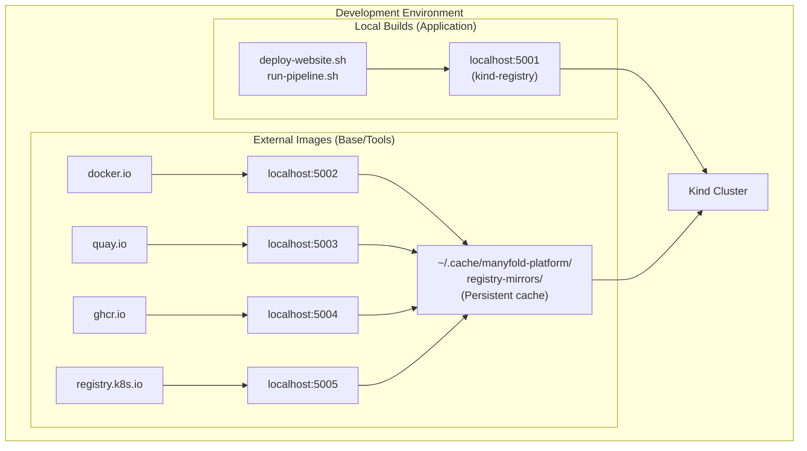
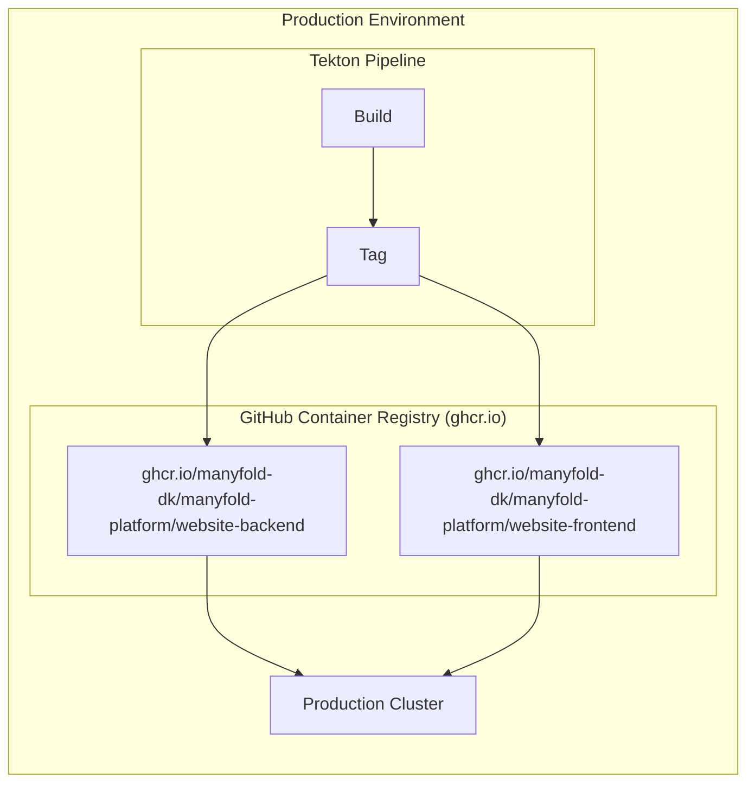
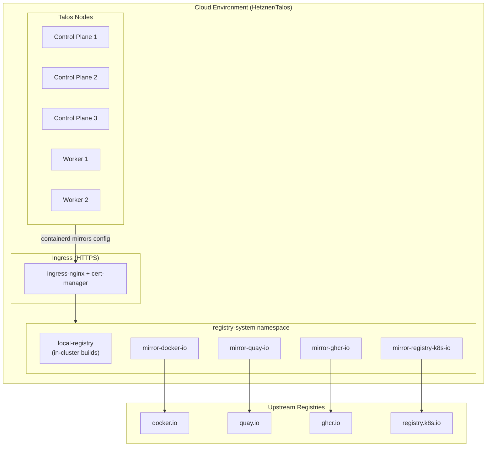

# ADR 0008: Container Registry Strategy

## Table of Contents

- [Status](#status)
- [Context](#context)
- [Decision](#decision)
- [Rationale](#rationale)
- [Implementation Details](#implementation-details)
- [Cloud Environment](#cloud-environment)
- [Consequences](#consequences)
- [Alternatives Considered](#alternatives-considered)
- [Migration Path](#migration-path)
- [References](#references)
- [Notes](#notes)

## Status

Accepted

## Context

The Manyfold Platform requires container registries for multiple purposes: storing locally-built images during development, caching external images to improve build times and reliability, and storing production images for deployment. A clear strategy is needed to address all these use cases.

### Requirements

1. **Local Development**: Store locally-built images for Kind cluster deployment
2. **Build Performance**: Cache frequently-pulled base images to speed up builds
3. **Offline Resilience**: Reduce dependency on external registries during development
4. **Production Images**: Store versioned, production-ready images with proper access control
5. **Cost Efficiency**: Minimize egress costs and rate limiting issues
6. **Simplicity**: Easy setup and maintenance for local development

### Registry Use Cases

| Use Case | Description | Frequency |
|----------|-------------|-----------|
| Local builds | Images built by deploy-website.sh | Multiple times/day |
| Pipeline builds | Images built by Tekton pipelines | Per commit |
| Base images | Node, Maven, Quarkus, etc. | Cached, updated periodically |
| Tool images | Buildah, kubectl, git, etc. | Cached, updated periodically |
| Production releases | Tagged, versioned images | Per release |

## Decision

We will use a **multi-registry strategy** with different registries for different purposes:

1. **Local Kind Registry** (`localhost:5001`): For locally-built application images
2. **Pull-Through Cache Registries** (`localhost:5002-5005`): For external image caching
3. **GitHub Container Registry** (`ghcr.io`): For production image storage

> Note (2026-09-27): the local kind cluster is retired, see [ADR-0054's amendment of 2026-09-27](0054-public-platform-and-private-instance-repositories.md#amendment-2026-09-27-no-demo-tree-throwaway-cloud-instances-instead); the local Kind registry and its `localhost` pull-through caches went with it, and the cloud cluster's pull-through caches and ghcr.io stand.

### Registry Architecture

#### Development Environment



#### Production Environment



<details>
<summary>ASCII diagram (backup)</summary>

```
┌─────────────────────────────────────────────────────────────────────────────┐
│                           Development Environment                            │
├─────────────────────────────────────────────────────────────────────────────┤
│                                                                             │
│  ┌─────────────────────┐      ┌─────────────────────────────────────────┐  │
│  │   Local Builds      │      │         External Images                  │  │
│  │   (Application)     │      │         (Base/Tools)                     │  │
│  │                     │      │                                         │  │
│  │  deploy-website.sh  │      │  docker.io ─────► localhost:5002        │  │
│  │  run-pipeline.sh    │      │  quay.io ───────► localhost:5003        │  │
│  │         │           │      │  ghcr.io ───────► localhost:5004        │  │
│  │         ▼           │      │  registry.k8s.io► localhost:5005        │  │
│  │   localhost:5001    │      │         │                               │  │
│  │   (kind-registry)   │      │         ▼                               │  │
│  │         │           │      │  ~/.cache/manyfold-platform/            │  │
│  │         ▼           │      │  registry-mirrors/                      │  │
│  │    Kind Cluster     │◄─────┤  (Persistent cache)                     │  │
│  └─────────────────────┘      └─────────────────────────────────────────┘  │
│                                                                             │
└─────────────────────────────────────────────────────────────────────────────┘

┌─────────────────────────────────────────────────────────────────────────────┐
│                           Production Environment                             │
├─────────────────────────────────────────────────────────────────────────────┤
│                                                                             │
│  ┌─────────────────────┐      ┌─────────────────────────────────────────┐  │
│  │   Tekton Pipeline   │      │         GitHub Container Registry       │  │
│  │                     │      │         (ghcr.io)                       │  │
│  │   Build ──► Tag ────┼──────┼──►  ghcr.io/manyfold-dk/manyfold-platform/    │  │
│  │                     │      │         website-backend, website-frontend│  │
│  │                     │      │                                         │  │
│  └─────────────────────┘      │           ▼                             │  │
│                               │     Production Cluster                  │  │
│                               └─────────────────────────────────────────┘  │
│                                                                             │
└─────────────────────────────────────────────────────────────────────────────┘
```

</details>

## Rationale

### Why Local Kind Registry?

**Simplicity for Local Development**:
- No authentication required for local builds
- Images immediately available to Kind cluster
- Fast push/pull (no network latency)
- Works offline once base images are cached

**Kind-Native Integration**:
- Kind documentation recommends this pattern
- Registry runs as a container connected to Kind network
- Automatic DNS resolution within cluster

**Ephemeral by Design**:
- Registry recreated with cluster
- No long-term storage concerns
- Clean slate for testing

### Why Pull-Through Cache Registries?

**Performance Benefits**:
- First pull caches image locally
- Subsequent pulls served from cache (< 1 second vs 10+ seconds)
- Dramatically faster pipeline execution
- Reduced network bandwidth usage

**Reliability Improvements**:
- Resilient to upstream registry outages
- No rate limiting issues (Docker Hub limits: 100 pulls/6hrs anonymous)
- Works during network issues after initial cache population

**Cost Efficiency**:
- Reduced egress from cloud registries
- Single pull from upstream, multiple uses locally
- Important for CI pipelines that pull same images repeatedly

**Registries Cached**:

| Registry | Port | Primary Use | Rate Limits |
|----------|------|-------------|-------------|
| docker.io | 5002 | Base images (node, maven, ubuntu) | 100/6hrs (anon) |
| quay.io | 5003 | Buildah, Red Hat images | Generous |
| ghcr.io | 5004 | GitHub-hosted images | Generous |
| registry.k8s.io | 5005 | Kubernetes images | Generous |

**Persistent Cache**:
- Cache stored in `~/.cache/manyfold-platform/registry-mirrors/`
- Survives cluster deletion and recreation
- Only cleared on explicit cleanup or disk space issues

### Why GitHub Container Registry (ghcr.io)?

**Integration with GitHub**:
- Native authentication via GITHUB_TOKEN
- Visibility tied to repository permissions
- Package management in same platform as code
- Automatic linking to source repository

**Cost-Effective**:
- Free for public repositories
- Generous limits for private repositories
- No per-pull charges

**Production-Ready Features**:
- Immutable tags supported
- Multi-architecture image support
- OCI-compliant
- Vulnerability scanning (via GitHub Security)

**Simplicity**:
- No infrastructure to manage
- Already using GitHub for source control
- Single credential (PAT) for all GitHub operations

### Why Not Self-Hosted Harbor?

Harbor was considered for production but deferred:

**Pros of Harbor**:
- Full control over storage and retention
- Built-in vulnerability scanning (Trivy)
- Image replication and geo-distribution
- Advanced access control and audit logging

**Cons for Current Phase**:
- Additional infrastructure to deploy and maintain
- Storage, backup, and upgrade overhead
- Operational complexity not justified yet
- ghcr.io meets current needs

**Future Consideration**:
- Will revisit when self-hosted registry becomes a requirement
- Migration path is straightforward (OCI-compliant images)

## Implementation Details

### Local Kind Registry Setup

```bash
# infrastructure/clusters/local/scripts/setup-registry.sh
# Creates registry container connected to Kind network

podman run -d --restart=always \
    --name kind-registry \
    --network kind \
    -p 127.0.0.1:5001:5000 \
    docker.io/library/registry:2

# Kind cluster config references the registry
# infrastructure/clusters/local/kind/cluster-config.yaml
containerdConfigPatches:
  - |-
    [plugins."io.containerd.grpc.v1.cri".registry]
      [plugins."io.containerd.grpc.v1.cri".registry.mirrors]
        [plugins."io.containerd.grpc.v1.cri".registry.mirrors."localhost:5001"]
          endpoint = ["http://kind-registry:5000"]
```

### Pull-Through Cache Setup

```bash
# infrastructure/clusters/local/scripts/setup-registry-mirrors.sh
# Creates pull-through caches for external registries

declare -A MIRRORS=(
    ["docker.io"]="5002"
    ["quay.io"]="5003"
    ["ghcr.io"]="5004"
    ["registry.k8s.io"]="5005"
)

for registry in "${!MIRRORS[@]}"; do
    port="${MIRRORS[$registry]}"
    podman run -d --restart=always \
        --name "mirror-${registry//./-}" \
        --network kind \
        -p "127.0.0.1:${port}:5000" \
        -v "${CACHE_DIR}/${registry}:/var/lib/registry" \
        -e "REGISTRY_PROXY_REMOTEURL=https://${registry}" \
        docker.io/library/registry:2
done
```

### Kind Cluster Mirror Configuration

```yaml
# infrastructure/clusters/local/kind/cluster-config.yaml (with mirrors)
containerdConfigPatches:
  - |-
    [plugins."io.containerd.grpc.v1.cri".registry]
      [plugins."io.containerd.grpc.v1.cri".registry.mirrors]
        [plugins."io.containerd.grpc.v1.cri".registry.mirrors."docker.io"]
          endpoint = ["http://mirror-docker-io:5000"]
        [plugins."io.containerd.grpc.v1.cri".registry.mirrors."quay.io"]
          endpoint = ["http://mirror-quay-io:5000"]
        [plugins."io.containerd.grpc.v1.cri".registry.mirrors."ghcr.io"]
          endpoint = ["http://mirror-ghcr-io:5000"]
        [plugins."io.containerd.grpc.v1.cri".registry.mirrors."registry.k8s.io"]
          endpoint = ["http://mirror-registry-k8s-io:5000"]
```

### Image Tagging Strategy

Following ADR-0003 (Versioning and Commit Standards):

| Context | Tag Format | Example | Registry |
|---------|------------|---------|----------|
| Local build | `localhost:5001/<app>:local` | `localhost:5001/website-backend:local` | Local Kind |
| PR/Branch | `<branch>-<short-sha>` | `feature-auth-a1b2c3d` | ghcr.io |
| Main branch | `main-<short-sha>` | `main-a1b2c3d` | ghcr.io |
| Release | `<semver>` | `x.y.z` | ghcr.io |
| Latest main | `latest` | `latest` | ghcr.io |

### Directory Structure

```
infrastructure/clusters/local/
├── kind/
│   ├── cluster-config.yaml           # Basic config (no mirrors)
│   └── cluster-config-mirrors.yaml   # Config with pull-through mirrors
├── scripts/
│   ├── setup-registry.sh             # Local Kind registry
│   ├── setup-registry-mirrors.sh     # Pull-through cache setup
│   └── cluster.sh                    # --with-mirrors flag support
└── manifests/
    └── registry/
        └── README.md                 # Registry documentation
```

### Cluster Creation Flags

```bash
# Basic cluster (no mirrors)
./cluster.sh create --with-ingress

# With pull-through mirrors (recommended)
./cluster.sh create --with-ingress --with-mirrors

# Full local development
./cluster.sh create --with-tekton --with-ingress --with-argocd --with-mirrors
```

## Cloud Environment

The cloud environment (Hetzner/Talos) uses a different approach for registry mirrors than the local Kind environment, while achieving the same goals of caching and reliability.

### Key Differences from Local

| Aspect | Local (Kind) | Cloud (Talos) |
|--------|--------------|---------------|
| Mirror hosts | `localhost:500x` ports | `mirror-*.<internal-domain>` HTTPS |
| TLS | HTTP (local only) | HTTPS with cert-manager |
| Configuration | Kind containerdConfigPatches | Talos machine config patches |
| Deployment | Podman containers on host | Kubernetes Deployments in cluster |
| DNS | Docker network DNS | External-dns managed records |

### Cloud Registry Architecture



### Cloud Mirror Endpoints

| Registry | Internal DNS | Purpose |
|----------|--------------|---------|
| docker.io | `mirror-docker-io.<internal-domain>` | Docker Hub images |
| quay.io | `mirror-quay-io.<internal-domain>` | Red Hat/Quay images |
| ghcr.io | `mirror-ghcr-io.<internal-domain>` | GitHub Container Registry |
| registry.k8s.io | `mirror-registry-k8s-io.<internal-domain>` | Kubernetes images |
| (local) | `local-registry.<internal-domain>` | In-cluster built images |

### Talos Machine Configuration

Registry mirrors are configured via Talos machine config patches applied through OpenTofu:

```yaml
# infrastructure/clusters/cloud/bootstrap/talos.tf
machine:
  registries:
    mirrors:
      docker.io:
        endpoints:
          - https://mirror-docker-io.<internal-domain>
      ghcr.io:
        endpoints:
          - https://mirror-ghcr-io.<internal-domain>
      quay.io:
        endpoints:
          - https://mirror-quay-io.<internal-domain>
      registry.k8s.io:
        endpoints:
          - https://mirror-registry-k8s-io.<internal-domain>
```

This configuration is applied to all nodes (control planes and workers) during cluster provisioning.

### TLS Configuration

The cloud mirrors use HTTPS with certificates managed by cert-manager:

1. **Ingress Controller**: ingress-nginx handles TLS termination
2. **Certificate Issuer**: cert-manager with Let's Encrypt (or internal CA)
3. **DNS Records**: external-dns creates `*.<internal-domain>` records
4. **Ingress Resource**: Routes traffic to mirror deployments

```yaml
# platform/resources/cloud/registry/registry-ingress.yaml
apiVersion: networking.k8s.io/v1
kind: Ingress
metadata:
  name: registry-mirrors
  annotations:
    cert-manager.io/cluster-issuer: letsencrypt-prod
spec:
  ingressClassName: nginx
  tls:
    - hosts:
        - mirror-docker-io.<internal-domain>
        - mirror-ghcr-io.<internal-domain>
        - mirror-quay-io.<internal-domain>
        - mirror-registry-k8s-io.<internal-domain>
      secretName: registry-mirrors-tls
  rules:
    # ... host rules for each mirror
```

### Why HTTPS in Cloud?

1. **Security**: Traffic may traverse untrusted networks
2. **Talos Requirements**: Talos containerd defaults to HTTPS for registries
3. **Certificate Trust**: Uses system CA bundle, no custom config needed
4. **Best Practice**: Production environments should always use TLS

### Cloud Registry Deployment

The registry mirrors are deployed via ArgoCD:

- **Application**: `platform/argocd/cloud/applications/registry.yaml`
- **Resources**: `platform/resources/cloud/registry/`
- **Namespace**: `registry-system`

Components deployed:
- 5 Deployment resources (local-registry + 4 mirrors)
- 5 Service resources
- 1 Ingress resource with TLS
- PersistentVolumeClaims for cache storage

### Verifying Cloud Mirrors

```bash
# Check mirror pods are running
kubectl --kubeconfig <cloud-kubeconfig> get pods -n registry-system

# Test mirror accessibility
curl -I https://mirror-docker-io.<internal-domain>/v2/

# Check ArgoCD application status
cd infrastructure/clusters/cloud/scripts
./setup-argocd.sh status | grep registry
```

## Consequences

### Positive

- **Fast Builds**: Cached images dramatically reduce build times
- **Reliable Development**: Less dependent on external registry availability
- **No Rate Limits**: Pull-through cache avoids Docker Hub rate limits
- **Cost Effective**: ghcr.io is free for public repos, no self-hosted infra
- **Simple Local Setup**: Single command enables full caching
- **Production Parity**: Same images used locally and in production
- **Persistent Cache**: Survives cluster recreation, only downloads once

### Negative

- **Disk Usage**: Cache can grow large over time (~5-10GB typical)
- **Initial Cold Start**: First pull still requires network access
- **Multiple Registries**: Mental overhead of knowing which registry for what
- **ghcr.io Dependency**: Production images require GitHub availability
- **Cache Staleness**: Old images may persist in cache
- **Private GHCR Storage (Free Plan)**: Production images are private and count against the org's 500 MB Free-tier package storage. Unmanaged, every CI build adds a permanent image version (immutable `main-<sha>`/`gha-<sha>` tag + untagged attestation blobs); this accumulates until it exhausts the tier and — with the default $0 spending limit — hard-blocks all GHCR push/pull

### Mitigations

- **Disk Usage**: Cache location is configurable; cleanup script available
- **Cold Start**: Pre-warm script can populate cache with common images
- **Multiple Registries**: Documentation clearly explains each registry's purpose
- **ghcr.io Dependency**: Can migrate to Harbor if self-hosting required
- **Cache Staleness**: Mirrors respect upstream cache headers; manual cleanup available
- **Private GHCR Storage**: A daily retention workflow (`.github/workflows/ghcr-cleanup.yml`) keeps the 3 most recent tagged versions per package, protects deployed tags, and prunes orphaned untagged blobs. See the GHCR storage strategy plan of 2026-05-30 (private)

## Alternatives Considered

### Single Self-Hosted Registry (Harbor)

- **Pros**: Single registry for all purposes, advanced features
- **Cons**: Operational overhead, complexity not justified for local dev
- **Decision**: Defer to Phase 3 (Cloud Infrastructure)

### Docker Hub Only

- **Pros**: Simplest setup, universal compatibility
- **Cons**: Rate limits, no local caching, cost for private images
- **Decision**: Rejected - rate limits problematic for CI

### No Caching (Direct Pull)

- **Pros**: Simplest, always fresh images
- **Cons**: Slow builds, network dependent, rate limit issues
- **Decision**: Rejected - unacceptable build times

### Local Registry for Everything

- **Pros**: Single local registry, full control
- **Cons**: Must manually push all base images, no auto-caching
- **Decision**: Rejected - too much manual management

## Migration Path

### Local Development → Production

1. Build locally with `localhost:5001/image:local`
2. Pipeline builds and tags for ghcr.io
3. ArgoCD deploys from ghcr.io tags
4. Same image, different registry paths

### ghcr.io → Harbor (Future)

If self-hosted registry becomes a requirement:

1. Deploy Harbor to production cluster
2. Configure image replication from ghcr.io
3. Update pipeline push targets
4. Update ArgoCD image references
5. Deprecate ghcr.io usage

## References

- [Kind Local Registry](https://kind.sigs.k8s.io/docs/user/local-registry/)
- [Registry Pull-Through Cache](https://docs.docker.com/registry/recipes/mirror/)
- [Docker Hub Rate Limits](https://docs.docker.com/docker-hub/download-rate-limit/)
- [GitHub Container Registry](https://docs.github.com/en/packages/working-with-a-github-packages-registry/working-with-the-container-registry)
- GHCR storage strategy plan of 2026-05-30 (private) -- retention/cleanup policy and Free-tier storage limits
- [Talos Registry Configuration](https://www.talos.dev/v1.9/talos-guides/configuration/pull-through-cache/)
- [ADR-0006: CI/CD Tooling Selection](0006-cicd-tooling-selection.md)
- Local implementation: `infrastructure/clusters/local/scripts/setup-registry.sh`
- Local mirror implementation: `infrastructure/clusters/local/scripts/setup-registry-mirrors.sh`
- Cloud Talos config: `infrastructure/clusters/cloud/bootstrap/talos.tf`
- Cloud registry resources: `platform/resources/cloud/registry/`

## Notes

This decision was made during Phase 1 of platform development (January 2026). The multi-registry strategy balances simplicity for local development with production readiness. Revisit if:

- Docker Hub rate limits become non-issues (unlikely)
- Self-hosted registry becomes a hard requirement
- ghcr.io limitations block production workflows
- Disk usage from caching becomes problematic
