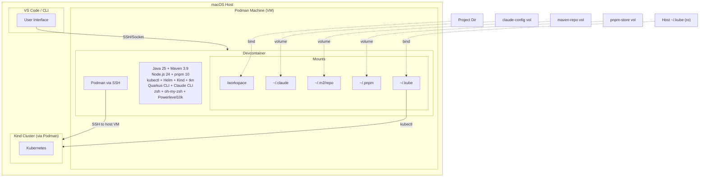

# ADR 0009: Development Environment Strategy

## Table of Contents

- [Status](#status)
- [Context](#context)
- [Decision](#decision)
- [Rationale](#rationale)
- [Implementation Details](#implementation-details)
- [Consequences](#consequences)
- [Alternatives Considered](#alternatives-considered)
- [Keeping In Sync](#keeping-in-sync)
- [References](#references)
- [Notes](#notes)

## Status

Accepted

## Context

The Manyfold Platform requires a consistent, reproducible development environment that works across different machines and developers. The environment must support Java/Quarkus backend development, Vue/Vite frontend development, Kubernetes tooling, and container builds.

### Requirements

1. **Consistency**: Same tools and versions across all development machines
2. **Reproducibility**: Environment can be recreated from scratch reliably
3. **Isolation**: Development tools don't pollute the host system
4. **Persistence**: Developer state (credentials, caches) survives rebuilds
5. **Kubernetes Access**: Full access to local Kind clusters from within the container
6. **Container Builds**: Ability to build and push container images
7. **Performance**: Fast startup and responsive development workflows
8. **Multiple Entry Points**: Support both VS Code and CLI-based workflows

### Approaches Evaluated

| Approach | Consistency | Isolation | Kubernetes | Container Builds |
|----------|-------------|-----------|------------|------------------|
| **Devcontainer** | Excellent | Excellent | Via mounts | Via Podman SSH |
| **Local Install** | Poor | None | Native | Native |
| **Vagrant/VM** | Good | Good | Complex | Native |
| **Nix** | Excellent | Good | Native | Native |
| **asdf/mise** | Good | Partial | Native | Native |

## Decision

We will use **VS Code Dev Containers** with **Podman** as the container runtime, supplemented by a **CLI script** (`dev-shell.sh`) for non-VS Code workflows.

### Architecture Overview



<details>
<summary>ASCII diagram (backup)</summary>

```
┌─────────────────────────────────────────────────────────────────────────────┐
│                              macOS Host                                      │
├─────────────────────────────────────────────────────────────────────────────┤
│                                                                             │
│  ┌───────────────────────┐    ┌───────────────────────────────────────────┐ │
│  │    VS Code / CLI      │    │           Podman Machine (VM)             │ │
│  │                       │    │                                           │ │
│  │  User Interface       │    │  ┌─────────────────────────────────────┐  │ │
│  │                       │    │  │        Devcontainer                 │  │ │
│  │                       │    │  │                                     │  │ │
│  │                       │    │  │  Java 25 + Maven 3.9                │  │ │
│  │                       │    │  │  Node.js 24 + pnpm 10               │  │ │
│  │                       │    │  │  kubectl + Helm + Kind + tkn        │  │ │
│  │                       │    │  │  Quarkus CLI + Claude CLI           │  │ │
│  └───────────┬───────────┘    │  │  zsh + oh-my-zsh + Powerlevel10k   │  │ │
│              │                │  │                                     │  │ │
│              │ SSH/Socket     │  │  /workspace ────────────────────────┼──┼─┼── Project Dir
│              │                │  │  ~/.claude ──── claude-config vol   │  │ │
│              │                │  │  ~/.m2/repo ─── maven-repo vol      │  │ │
│              │                │  │  ~/.pnpm ────── pnpm-store vol      │  │ │
│              │                │  │  ~/.kube ────── Host ~/.kube (ro)   │  │ │
│              ▼                │  │                                     │  │ │
│  ┌───────────────────────┐    │  │  Podman ◄───── SSH to host VM       │  │ │
│  │   Kind Cluster        │    │  └─────────────────────────────────────┘  │ │
│  │   (via Podman)        │    │                                           │ │
│  │                       │◄───┼───────────────── kubectl via ~/.kube      │ │
│  └───────────────────────┘    └───────────────────────────────────────────┘ │
│                                                                             │
└─────────────────────────────────────────────────────────────────────────────┘
```

</details>

### Key Components

1. **Devcontainer** (`.devcontainer/`): VS Code integration
2. **dev-shell.sh** (`scripts/dev-shell.sh`): CLI alternative
3. **Podman**: Container runtime (no Docker daemon)
4. **Named Volumes**: Persistent caches and credentials
5. **Bind Mounts**: Project files and Kubernetes access

> Note (2026-09-27): the local kind cluster is retired, see [ADR-0054's amendment of 2026-09-27](0054-public-platform-and-private-instance-repositories.md#amendment-2026-09-27-no-demo-tree-throwaway-cloud-instances-instead); the dev container no longer installs kind.

## Rationale

### Why Dev Containers?

**Consistency and Reproducibility**:
- Single Dockerfile defines all tools and versions
- Anyone with VS Code + Podman gets identical environment
- No "works on my machine" issues
- Version-controlled configuration

**Isolation**:
- Development tools don't pollute host system
- Can experiment freely without risk
- Multiple projects can use different tool versions
- Clean separation of concerns

**VS Code Integration**:
- Extensions automatically installed
- Settings preconfigured for Java, Vue, etc.
- Port forwarding just works
- Integrated terminal with proper environment

**Industry Standard**:
- Open specification (devcontainer.json)
- GitHub Codespaces compatible
- Works with multiple IDEs (VS Code, IntelliJ, etc.)
- Active community and tooling

### Why Podman Over Docker?

**No Daemon**:
- Podman is daemonless (no background service)
- Each container is a direct child process
- Better resource management
- Simpler security model

**Rootless Operation**:
- Runs without root privileges by default
- Better security posture
- No special group membership required
- Aligns with production container security

**Docker Compatibility**:
- Drop-in replacement for Docker CLI
- Supports Docker Compose files
- Reads Dockerfiles natively
- Same image format (OCI)

**macOS Native Support**:
- Podman Desktop provides excellent macOS experience
- VM management is seamless
- Native ARM64 support for Apple Silicon

### Why CLI Alternative (dev-shell.sh)?

**Not Everyone Uses VS Code**:
- Some developers prefer vim, Emacs, or other editors
- CI/CD needs may require headless access
- Quick tasks don't need full IDE startup

**Feature Parity**:
- Same container image as VS Code devcontainer
- Same volume mounts and environment
- Consistent experience regardless of entry point

**Flexibility**:
- Interactive shell: `./scripts/dev-shell.sh`
- Background daemon: `./scripts/dev-shell.sh --daemon`
- Execute commands: `./scripts/dev-shell.sh --exec "mvn test"`

### Why This Tool Selection?

**Java 25 + Maven 3.9**:
- Java 25 is latest LTS (released September 2025)
- Maven is standard build tool for Quarkus
- Versions aligned with Quarkus requirements

**Node.js 24 + pnpm 10**:
- Node.js 24 is current LTS ("Krypton", April 2025 - April 2028)
- pnpm is faster and more disk-efficient than npm
- Required for Vue/Vite frontend development

**kubectl + Helm + Kind + tkn**:
- Full Kubernetes development toolkit
- Kind for local cluster management
- Helm for chart-based deployments
- tkn (Tekton CLI) for pipeline management

**Quarkus CLI + Claude CLI**:
- Quarkus CLI for project scaffolding and management
- Claude CLI for AI-assisted development
- Both enhance developer productivity

**zsh + oh-my-zsh + Powerlevel10k**:
- Modern shell with excellent auto-completion
- Visual git status and context in prompt
- Developer-friendly defaults

### Volume Strategy

**Named Volumes (Persistent)**:

| Volume | Path | Purpose |
|--------|------|---------|
| `claude-config` | `~/.claude` | Claude CLI authentication |
| `maven-repo` | `~/.m2/repository` | Maven dependency cache |
| `pnpm-store` | `~/.local/share/pnpm/store` | pnpm package cache |

These volumes:
- Survive container rebuilds
- Dramatically speed up subsequent builds
- Keep authentication state across sessions

**Bind Mounts (Shared with Host)**:

| Host Path | Container Path | Purpose |
|-----------|----------------|---------|
| Project dir | `/workspace` | Source code |
| `~/.kube` | `~/.kube` (ro) | Kubernetes config |
| `~/.manyfold-worktrees` | `~/.manyfold-worktrees` | Git worktrees |
| Podman SSH key | `~/.ssh/podman-machine` | Container builds |

### Podman Connection Strategy

On macOS, Podman runs in a VM and Unix sockets can't be directly mounted into containers. We solve this with SSH:

1. **SSH Identity Mounted**: Podman machine's SSH key is mounted read-only
2. **Machine Config Mounted**: JSON config provides SSH port dynamically
3. **postStartCommand**: Configures `podman system connection` on each start
4. **host.containers.internal**: Special DNS name resolves to host VM

This allows:
- Building images inside the devcontainer
- Pushing to registries
- Managing containers
- Full Podman functionality

### Git Credentials Strategy

**Environment-Based**:
- `GITHUB_PERSONAL_ACCESS_TOKEN` set in `.env` file
- Auto-configured on container startup
- Git credential helper stores token securely
- Works for push/pull to private repositories

**Why Not SSH Keys?**:
- PAT is simpler to configure
- Works with HTTPS URLs (GitHub default)
- Easier to rotate
- No SSH agent forwarding complexity

## Implementation Details

### Devcontainer Configuration

```json
// .devcontainer/devcontainer.json (key sections)
{
  "name": "Manyfold Platform",
  "build": {
    "dockerfile": "Dockerfile",
    "args": {
      "USER_UID": "${localEnv:USER_UID:501}",
      "USER_GID": "${localEnv:USER_GID:20}"
    }
  },
  "mounts": [
    { "source": "claude-config", "target": "/home/vscode/.claude", "type": "volume" },
    { "source": "maven-repo", "target": "/home/vscode/.m2/repository", "type": "volume" },
    { "source": "pnpm-store", "target": "/home/vscode/.local/share/pnpm/store", "type": "volume" },
    { "source": "${localEnv:HOME}/.kube", "target": "/home/vscode/.kube", "type": "bind" }
  ],
  "forwardPorts": [8080, 5173, 9229],
  "postStartCommand": "/workspace/.devcontainer/setup-podman.sh"
}
```

### Dockerfile Structure

```dockerfile
# .devcontainer/Dockerfile (simplified)
FROM ubuntu:24.04

# System packages
RUN apt-get update && apt-get install -y curl wget git build-essential zsh ...

# Java 25 LTS (Eclipse Temurin)
RUN wget -O - https://packages.adoptium.net/... && apt-get install -y temurin-25-jdk

# Maven 3.9
ARG MAVEN_VERSION=3.9.12
RUN wget .../apache-maven-${MAVEN_VERSION}-bin.tar.gz && tar -xzf ...

# Node.js 24 LTS + pnpm
RUN curl -fsSL https://deb.nodesource.com/setup_24.x | bash - && apt-get install -y nodejs
RUN npm install -g pnpm@latest

# Kubernetes tooling
RUN curl -LO ".../kubectl" && curl -Lo ./kind ".../kind" && ...

# Quarkus CLI, Claude CLI
RUN curl -Ls https://sh.jbang.dev | bash -s - app install quarkus@quarkusio
RUN curl -fsSL https://claude.ai/install.sh | bash

# zsh + oh-my-zsh + Powerlevel10k
RUN sh -c "$(curl -fsSL .../install.sh)" && git clone .../powerlevel10k

# Non-root user with sudo
ARG USERNAME=vscode
RUN useradd ... && echo $USERNAME ALL=\(root\) NOPASSWD:ALL > /etc/sudoers.d/$USERNAME
```

### dev-shell.sh CLI

```bash
# scripts/dev-shell.sh (key modes)

# Interactive shell
./scripts/dev-shell.sh

# Rebuild and start
./scripts/dev-shell.sh --rebuild

# Background daemon
./scripts/dev-shell.sh --daemon
./scripts/dev-shell.sh --exec zsh

# Maintenance
./scripts/dev-shell.sh --status
./scripts/dev-shell.sh --stop
./scripts/dev-shell.sh --clean
```

### Directory Structure

```
.devcontainer/
├── Dockerfile              # Container image definition
├── devcontainer.json       # VS Code Dev Container config
├── dotfiles/               # Shell configuration
│   ├── zshrc.template      # zsh config
│   ├── zprofile.template   # zsh profile
│   └── p10k.zsh            # Powerlevel10k theme
├── setup-git-credentials.sh # Git credential helper
├── setup-podman.sh         # Podman SSH connection
├── README.md               # Full documentation
└── QUICK-START.md          # Quick reference

scripts/
└── dev-shell.sh            # CLI alternative to VS Code
```

## Consequences

### Positive

- **Consistent Environment**: All developers use identical tools and versions
- **Quick Onboarding**: New developers can start in minutes
- **Isolated Development**: Host system stays clean
- **Persistent Caches**: Fast rebuilds after initial setup
- **Flexible Entry Points**: VS Code or CLI, developer's choice
- **Full Kubernetes Access**: Manage Kind clusters, run pipelines, deploy apps
- **Container Builds**: Build and push images from within container
- **Version Controlled**: Environment definition is part of the repository

### Negative

- **Podman Machine Overhead**: VM adds memory and CPU overhead on macOS
- **Initial Build Time**: First container build takes 5-10 minutes
- **SSH Complexity**: Podman-in-container requires SSH tunneling
- **Debugging Complexity**: Issues span host, VM, and container layers
- **macOS Specific**: Some setup steps are macOS-specific (Podman machine)

### Mitigations

- **Overhead**: Acceptable for development; production doesn't use this
- **Build Time**: Subsequent rebuilds are fast; volumes cache dependencies
- **SSH Complexity**: Automated via setup scripts; rarely needs manual intervention
- **Debugging**: Comprehensive documentation and troubleshooting guides
- **macOS Specific**: Linux users have simpler setup (native Podman)

## Alternatives Considered

### Local Tool Installation

- **Pros**: Native performance, no container overhead
- **Cons**: Inconsistent versions, pollutes host, hard to maintain
- **Decision**: Rejected - "works on my machine" problems are unacceptable

### Vagrant/VirtualBox

- **Pros**: Full VM isolation, well-established
- **Cons**: Heavy overhead, slow startup, poor IDE integration
- **Decision**: Rejected - devcontainers provide better DX

### Nix/NixOS

- **Pros**: Excellent reproducibility, declarative
- **Cons**: Steep learning curve, complex syntax, different paradigm
- **Decision**: Rejected - barrier to entry too high for contributors

### Docker Desktop

- **Pros**: Familiar to most developers
- **Cons**: Licensing issues, daemon-based, heavier than Podman
- **Decision**: Rejected - Podman is free, daemonless, more aligned with OCI standards

### GitHub Codespaces

- **Pros**: Zero local setup, cloud-based
- **Cons**: Requires internet, usage costs, latency for local Kind
- **Decision**: Not rejected, but devcontainer.json is compatible if needed

## Keeping In Sync

**Critical**: `.devcontainer/` and `scripts/dev-shell.sh` must stay synchronized:

- Same volume mounts
- Same environment variables
- Same port forwards
- Same tools installed

When updating one, always verify the other still works.

## References

- [VS Code Dev Containers](https://code.visualstudio.com/docs/devcontainers/containers)
- [Devcontainer Specification](https://containers.dev/implementors/spec/)
- [Podman Desktop](https://podman-desktop.io/)
- [Podman Machine](https://docs.podman.io/en/latest/markdown/podman-machine.1.html)
- Local implementation: `.devcontainer/`, `scripts/dev-shell.sh`
- Setup guide: `docs/setup/macos-setup.md`

## Notes

This decision was made during Phase 1 of platform development (January 2026). The devcontainer approach provides excellent consistency and isolation while maintaining developer productivity. Revisit if:

- Container overhead becomes problematic for heavy workloads
- Team grows and needs more flexibility in tool choices
- Cloud-based development (Codespaces) becomes primary workflow
- Significant issues with Podman-in-container pattern emerge
