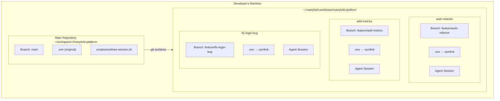
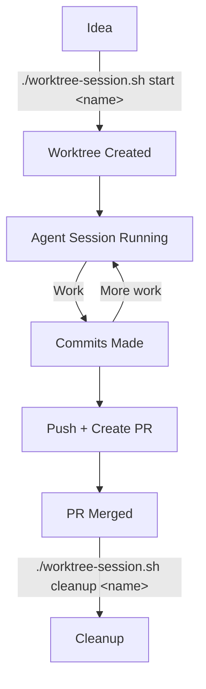

# ADR 0011: Git Worktree Strategy for Parallel Development

## Table of Contents

- [Status](#status)
- [Context](#context)
- [Decision](#decision)
- [Rationale](#rationale)
- [Implementation Details](#implementation-details)
- [Consequences](#consequences)
- [Alternatives Considered](#alternatives-considered)
- [Best Practices](#best-practices)
- [References](#references)
- [Notes](#notes)

## Status

Accepted

## Context

The Manyfold Platform uses AI-assisted development tools. A common workflow is to run multiple agent sessions in parallel, each working on different tasks.

### Problem

Running multiple agent sessions on the same Git repository creates conflicts:
- File modifications from one session can interfere with another
- Git state (staged changes, branch) is shared
- Context confusion between sessions
- Merge conflicts during parallel development

### Requirements

1. **Session Isolation**: Each agent session must have its own working directory
2. **Branch Management**: Each task gets a dedicated feature branch
3. **Environment Sharing**: Common configuration (.env) should be shared
4. **Easy Setup**: Starting a new session should be quick and friction-free
5. **Auto-Trust**: New sessions shouldn't require manual trust approval
6. **Cleanup**: Easy removal of completed sessions
7. **PR Workflow**: Sessions should integrate with standard Git/GitHub workflow

## Decision

We will use **Git worktrees** to enable parallel agent sessions, managed by a generic helper script (`worktree-session.sh`) that automates worktree creation, trust configuration, cleanup, and repo-specific environment symlink setup.

### Architecture



<details>
<summary>ASCII diagram (backup)</summary>

```
┌─────────────────────────────────────────────────────────────────────────────┐
│                           Developer's Machine                                │
├─────────────────────────────────────────────────────────────────────────────┤
│                                                                             │
│  ┌─────────────────────────────────────────┐                               │
│  │  Main Repository                         │                               │
│  │  <workspace>/manyfold-platform           │                               │
│  │                                          │                               │
│  │  - Branch: main                          │                               │
│  │  - Contains .env (original)              │                               │
│  │  - scripts/worktree-session.sh           │                               │
│  └────────────────┬─────────────────────────┘                               │
│                   │                                                          │
│                   │ git worktree                                             │
│                   │                                                          │
│  ┌────────────────┴─────────────────────────────────────────────────────┐   │
│  │                        ~/.manyfold-worktrees/manyfold-platform        │   │
│  ├───────────────────────────────────────────────────────────────────────┤   │
│  │                                                                       │   │
│  │  ┌─────────────────┐  ┌─────────────────┐  ┌─────────────────┐       │   │
│  │  │  auth-refactor  │  │  add-metrics    │  │  fix-login-bug  │       │   │
│  │  │                 │  │                 │  │                 │       │   │
│  │  │  Branch:        │  │  Branch:        │  │  Branch:        │       │   │
│  │  │  feature/auth-  │  │  feature/add-   │  │  feature/fix-   │       │   │
│  │  │  refactor       │  │  metrics        │  │  login-bug      │       │   │
│  │  │                 │  │                 │  │                 │       │   │
│  │  │  .env → symlink │  │  .env → symlink │  │  .env → symlink │       │   │
│  │  │                 │  │                 │  │                 │       │   │
│  │  │  ┌───────────┐  │  │  ┌───────────┐  │  │  ┌───────────┐  │       │   │
│  │  │  │   Agent   │  │  │  │   Agent   │  │  │  │   Agent   │  │       │   │
│  │  │  │  Session  │  │  │  │  Session  │  │  │  │  Session  │  │       │   │
│  │  │  └───────────┘  │  │  └───────────┘  │  │  └───────────┘  │       │   │
│  │  └─────────────────┘  └─────────────────┘  └─────────────────┘       │   │
│  │                                                                       │   │
│  └───────────────────────────────────────────────────────────────────────┘   │
│                                                                             │
└─────────────────────────────────────────────────────────────────────────────┘
```

</details>

### Key Components

1. **`worktree-session.sh`**: Helper script for worktree management
2. **Worktree Location**: `~/.manyfold-worktrees/manyfold-platform/<task-name>`
3. **Branch Naming**: `feature/<task-name>`
4. **Auto-Trust**: Automatic addition to `~/.claude.json` trusted projects
5. **Environment Sharing**: Symlink to main repository's `.env` file

## Rationale

### Why Git Worktrees?

**Native Git Feature**:
- Built into Git, no external tools required
- Proven, stable technology
- Works with all Git hosting platforms (GitHub, GitLab, etc.)

**True Isolation**:
- Each worktree has its own working directory
- Separate index (staging area)
- No file conflicts between sessions
- Can have different branches checked out simultaneously

**Shared History**:
- All worktrees share the same Git object database
- Common history, branches, and remotes
- Efficient disk usage (objects stored once)
- Easy to merge between worktrees

**Lightweight**:
- Fast to create (seconds, not minutes)
- Low disk overhead (shared objects)
- No VM or container overhead

### Why This Location?

**`~/.manyfold-worktrees/manyfold-platform/`**:
- Outside the main repository (no nesting issues)
- Grouped by project (supports multiple projects)
- In home directory (survives project moves)
- Hidden directory (doesn't clutter file browser)
- Neutral naming that works for agent sessions

### Why Auto-Trust?

The current local agent tooling prompts users to trust new directories before allowing tool execution. For worktrees of an already-trusted project, this creates unnecessary friction. The helper updates the existing trusted-directory state file used by the installed tooling today.

**Implementation**:
```bash
# Add to ~/.claude.json trusted projects
jq --arg path "$worktree_dir" \
   '.projects[$path] = {
      "allowedTools": [],
      "hasTrustDialogAccepted": true,
      ...
   }' "$HOME/.claude.json" > "$HOME/.claude.json.tmp"
mv "$HOME/.claude.json.tmp" "$HOME/.claude.json"
```

This inherits the trust of the main repository, avoiding the "Do you trust this directory?" prompt.

### Why Symlink .env?

**Shared Configuration**:
- API keys, tokens, and secrets in `.env`
- All sessions need the same credentials
- Changing credentials once updates all sessions
- `.env` is gitignored, so symlink works correctly

**Alternative Considered - Copying .env**:
- Would require manual updates when credentials change
- Potential for stale credentials
- Rejected: Symlink is simpler and always current

### Session Lifecycle



<details>
<summary>ASCII diagram (backup)</summary>

```
┌─────────┐    ./worktree-session.sh start <name>  ┌─────────────┐
│  Idea   │ ─────────────────────────────────────► │  Worktree   │
└─────────┘                                        │  Created    │
                                                   └──────┬──────┘
                                                          │
                                                          ▼
                                                   ┌─────────────┐
                                                   │   Agent     │
                                                   │  Session    │◄──── Work
                                                   │  Running    │       │
                                                   └──────┬──────┘       │
                                                          │              │
                                                          ▼              │
                                                   ┌─────────────┐       │
                                                   │  Commits    ├───────┘
                                                   │  Made       │
                                                   └──────┬──────┘
                                                          │
                                                          ▼
                                                   ┌─────────────┐
                                                   │  Push +     │
                                                   │  Create PR  │
                                                   └──────┬──────┘
                                                          │
                                                          ▼
                                                   ┌─────────────┐
│                                                   │  PR Merged  │
                                                   └──────┬──────┘
                                                          │
                                                          ▼
    ./worktree-session.sh cleanup <name>           ┌─────────────┐
◄───────────────────────────────────────────────── │  Cleanup    │
                                                   └─────────────┘
```

</details>

## Implementation Details

### worktree-session.sh Commands

```bash
# Start new session
./scripts/worktree-session.sh start <task-name>
# Creates: ~/.manyfold-worktrees/manyfold-platform/<task-name>
# Branch: feature/<task-name>

# List all active sessions
./scripts/worktree-session.sh list
# Shows all worktrees with their branches and paths

# Switch to existing session
./scripts/worktree-session.sh switch <task-name>
# Opens new shell in the worktree directory

# Show status
./scripts/worktree-session.sh status
# Shows if in worktree, current branch, git status

# Cleanup single session
./scripts/worktree-session.sh cleanup <task-name>
# Removes worktree and deletes branch

# Cleanup all sessions
./scripts/worktree-session.sh cleanup-all
# Removes ALL worktrees except main
```

`worktree-session.sh` is the low-level worktree primitive. It creates the worktree, feature branch, and repo-specific environment symlinks when their source files exist. Higher-level bootstrap such as local cluster branch setup lives in the `dev-workflow` skill described by [ADR 0026](0026-developer-workflow-strategy.md).

> Note (2026-09-27): the local kind cluster is retired, see [ADR-0054's amendment of 2026-09-27](0054-public-platform-and-private-instance-repositories.md#amendment-2026-09-27-no-demo-tree-throwaway-cloud-instances-instead); the `dev-workflow` skill no longer sets up a local cluster branch.

### Workflow Example

```bash
# Terminal 1: Start authentication refactor
./scripts/worktree-session.sh start auth-refactor
cd ~/.manyfold-worktrees/manyfold-platform/auth-refactor
<start-your-agent>

# Terminal 2: Start metrics feature
./scripts/worktree-session.sh start add-metrics
cd ~/.manyfold-worktrees/manyfold-platform/add-metrics
<start-your-agent>

# Each agent session works independently
# Different files, different branches, no conflicts

# When done with auth-refactor:
cd ~/.manyfold-worktrees/manyfold-platform/auth-refactor
git push -u origin feature/auth-refactor
gh pr create --title "Refactor authentication"

# After PR is merged:
./scripts/worktree-session.sh cleanup auth-refactor
```

### Project Instruction Integration

The project's `CLAUDE.md` includes the source-of-truth worktree instructions referenced by agent-facing compatibility docs:

```markdown
## Working with Git Worktrees

**IMPORTANT**: At the start of each session, check if you're in a worktree:

\`\`\`bash
git rev-parse --git-dir  # If contains "worktrees", you're in a worktree
\`\`\`

**If in a worktree** (feature branch):
- You're working on an isolated task - commit freely
- Use conventional commits with descriptive messages
- When ready, create PR to merge back to `main`

**If in main repository**:
- Be more cautious with commits
- Consider suggesting a worktree for complex tasks
```

### Directory Structure

```
~/.manyfold-worktrees/
└── manyfold-platform/
    ├── auth-refactor/        # Worktree for auth task
    │   ├── .env → symlink to main/.env
    │   ├── apps/
    │   ├── infrastructure/
    │   └── ...
    ├── add-metrics/          # Worktree for metrics task
    │   └── ...
    └── fix-login-bug/        # Worktree for bug fix
        └── ...

<workspace>/manyfold-platform/  # Main repo
├── .env                      # Original .env file
├── scripts/
│   ├── worktree-session.sh   # Session management script
└── ...
```

## Consequences

### Positive

- **True Isolation**: No file conflicts between parallel agent sessions
- **Independent Branches**: Each task on its own feature branch
- **Efficient**: Shared Git objects, fast creation
- **Standard Workflow**: Uses Git features, integrates with GitHub PRs
- **Auto-Trust**: No repeated trust prompts for worktrees
- **Shared Config**: .env symlink keeps credentials in sync
- **Easy Cleanup**: Single command removes worktree and branch

### Negative

- **Learning Curve**: Developers need to understand worktrees
- **Additional Commands**: New script to learn (`worktree-session.sh`)
- **Disk Space**: Each worktree has full working copy (though objects shared)
- **jq Dependency**: Auto-trust requires jq for JSON manipulation
- **Manual Cleanup**: Sessions must be explicitly cleaned up

### Mitigations

- **Learning Curve**: Comprehensive documentation and cheat sheet
- **Commands**: Script abstracts Git complexity
- **Disk Space**: Cleanup unused sessions; shared objects minimize impact
- **jq**: Common tool, falls back gracefully if missing
- **Cleanup**: List command shows all sessions; cleanup-all for bulk removal

## Alternatives Considered

### Separate Git Clones

- **Pros**: Complete isolation, familiar to all developers
- **Cons**: No shared history, large disk usage, slow to create
- **Decision**: Rejected - worktrees are more efficient and share history

### Git Stash-Based Workflow

- **Pros**: Uses familiar Git commands
- **Cons**: Doesn't allow concurrent work, easy to lose stashes
- **Decision**: Rejected - doesn't support true parallel sessions

### Docker/Devcontainer per Session

- **Pros**: Full environment isolation
- **Cons**: Heavy resource usage, slow startup, complex setup
- **Decision**: Rejected - overkill for file isolation; containers for dev env, not per-session

### Branch Switching with Commit Everything

- **Pros**: Simple, no new concepts
- **Cons**: Forces premature commits, loses uncommitted work
- **Decision**: Rejected - too disruptive to workflow

### IDE Workspaces

- **Pros**: IDE-level isolation
- **Cons**: IDE-specific, doesn't work with CLI tools
- **Decision**: Rejected - the agent workflow is CLI-based

## Best Practices

1. **Descriptive Task Names**: Use `auth-refactor`, not `test` or `temp`
2. **One Task Per Worktree**: Keep sessions focused
3. **Commit Frequently**: Each session is isolated, commit freely
4. **Clean Up After Merge**: Remove worktrees when PR is merged
5. **Use Conventional Commits**: Helps with changelog and releases
6. **Create PRs Before Cleanup**: Push changes before removing worktree
7. **Don't Nest Worktrees**: Keep all worktrees in `~/.manyfold-worktrees/`

## References

- [Git Worktrees Documentation](https://git-scm.com/docs/git-worktree)
- Current trust-file format: `~/.claude.json`
- Session script: `scripts/worktree-session.sh`
- Developer guide on parallel sessions (private)
- `CLAUDE.md` worktree section

## Notes

This decision was made during Phase 1 of platform development (January 2026). The worktree strategy enables efficient parallel agent-assisted development. Revisit if:

- Git worktrees prove too complex for the team
- The installed agent tooling adds native multi-session support
- Resource constraints make multiple worktrees impractical
- A better isolation mechanism emerges
