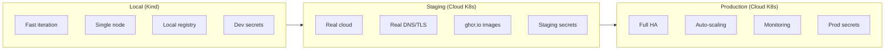

# ADR 0012: Local vs Cloud Environment Parity

## Table of Contents

- [Status](#status)
- [Context](#context)
- [Decision](#decision)
- [Rationale](#rationale)
- [Implementation Details](#implementation-details)
- [Consequences](#consequences)
- [Parity Checklist](#parity-checklist)
- [Future Considerations](#future-considerations)
- [References](#references)
- [Notes](#notes)

## Status

Accepted

> Note (2026-09-27): the local kind cluster is retired, see [ADR-0054's amendment of 2026-09-27](0054-public-platform-and-private-instance-repositories.md#amendment-2026-09-27-no-demo-tree-throwaway-cloud-instances-instead); this record's local environment no longer exists, and development and verification run against the cloud cluster.

## Context

The Manyfold Platform aims to provide both a local development environment and production-grade cloud deployment. A common challenge is maintaining parity between these environments while balancing local simplicity with production realism.

### Requirements

1. **Dev/Prod Parity**: Applications should behave similarly locally and in production
2. **Local Simplicity**: Local setup shouldn't require complex cloud infrastructure
3. **Production Realism**: Local environment should surface issues that would occur in production
4. **Fast Iteration**: Local development should support rapid feedback cycles
5. **Resource Efficiency**: Local environment shouldn't require excessive resources
6. **Tool Consistency**: Same deployment tools (kubectl, Helm, ArgoCD) work in both environments

### The Trade-off

| Aspect | Full Parity | Simplified Local |
|--------|-------------|------------------|
| Realism | High | Lower |
| Complexity | High | Low |
| Setup Time | Long | Short |
| Resources | Heavy | Light |
| Feedback Speed | Slower | Faster |

## Decision

We will use a **parity-focused approach** with Kind (Kubernetes in Docker/Podman) locally, accepting certain simplifications that don't affect application behavior while maintaining production-grade deployment patterns.

### Parity Maintained

| Aspect | Local | Production | Notes |
|--------|-------|------------|-------|
| **Container Runtime** | Podman/Kind | Kubernetes (CRI-O/containerd) | OCI-compatible images |
| **Orchestration** | Kubernetes (Kind) | Kubernetes (managed/self-hosted) | Same manifests |
| **CI/CD** | Tekton | Tekton | Same pipelines |
| **GitOps** | ArgoCD | ArgoCD | Same patterns |
| **Ingress** | Cilium Gateway API | Cilium Gateway API + Hetzner LB | Same HTTPRoute routing rules |
| **Network Policies** | Cilium | Cilium | Same CNP manifests |
| **Observability** | Hubble | Hubble | Same flow visibility |
| **Container Images** | Same | Same | Built once, run anywhere |

### Accepted Simplifications

| Aspect | Local | Production | Rationale |
|--------|-------|------------|-----------|
| **Registry** | localhost:5001 | ghcr.io | Local is faster; production needs remote |
| **Storage** | hostPath/emptyDir | Cloud PV/CSI | Local doesn't need durability |
| **DNS** | /etc/hosts | External DNS | Local doesn't need domain management |
| **TLS** | Self-signed/none | cert-manager/ACME | Local trust not critical |
| **Secrets** | Kubernetes Secrets | External Secrets | Local doesn't need Vault/AWS SM |
| **Node Count** | Single node | Multi-node | HA not needed locally |
| **Resource Limits** | Relaxed | Strict | Local has known resource constraints |

### Local-First Security Relaxations

The following security configurations are intentionally relaxed for local development convenience. These MUST be properly configured for production deployments:

| Relaxation | Local Behavior | Production Requirement | Implementation |
|------------|----------------|------------------------|----------------|
| **CORS** | Enabled for localhost:5173 | Disabled or strictly scoped | Quarkus `%dev` profile prefix |
| **API authentication** | Relaxed/none | Full auth required | Profile-based config |
| **Rate limiting** | Disabled | Enabled | Profile-based config |
| **Security headers** | Minimal | Full OWASP headers | Profile-based config |

**How CORS is scoped to dev profile (Quarkus example):**
```properties
# Only enabled for dev profile - production has CORS disabled by default
%dev.quarkus.http.cors.enabled=true
%dev.quarkus.http.cors.origins=http://localhost:5173
```

**Production checklist for security:**
- [ ] CORS disabled or scoped to specific production domains
- [ ] API authentication enforced (OAuth2, JWT, or API keys)
- [ ] Rate limiting enabled at ingress level
- [ ] Security headers configured (CSP, HSTS, X-Frame-Options)
- [ ] Secrets managed via External Secrets Operator

## Rationale

### Why Kind for Local?

**True Kubernetes**:
- Real Kubernetes API, not a simulator
- Same kubectl, Helm, and manifests
- CRDs and controllers work identically
- NetworkPolicies enforced (with Cilium)

**Podman Integration**:
- Works seamlessly with Podman on macOS
- No Docker daemon required
- Rootless containers where possible
- Apple Silicon native support

**Fast Lifecycle**:
- Cluster creation: ~60 seconds
- Cluster deletion: ~10 seconds
- Can recreate multiple times per day
- Supports quick experimentation

**Resource Efficient**:
- Single-node cluster sufficient for development
- ~2GB RAM baseline, scales with workloads
- Runs alongside development tools

### Why Not Minikube?

- Heavier VM-based approach (especially on macOS)
- Docker-centric design
- Podman support is secondary
- Kind is better integrated with cloud-native tooling

### Why Not k3s/k3d?

- Good option, but Kind has better community support
- Both work similarly for local development
- Kind is the Kubernetes SIG project for testing
- Decision: Either would work; Kind chosen for ecosystem

### Why Tekton Locally?

**Same Pipeline Everywhere**:
- Pipelines tested locally run identically in production
- No "works in CI but not locally" surprises
- Developers can debug pipeline issues locally

**Real Container Builds**:
- Buildah runs inside Tekton tasks
- Same multi-stage builds as production
- Image vulnerabilities visible early

**Production Workflows**:
- Same task definitions
- Same workspace patterns
- Same trigger configurations

### Why ArgoCD Locally?

**GitOps Practice**:
- Learn GitOps patterns on local cluster
- Test manifest changes before pushing
- Understand sync behavior and rollbacks

**Real Reconciliation**:
- ArgoCD continuously reconciles state
- Drift detection works locally
- Self-healing behavior visible

**Production Preparation**:
- Same Application definitions
- Same project structure
- Same sync policies

### Why Cilium Locally?

**Network Policy Development**:
- Develop and test CiliumNetworkPolicies
- L7 policies work identically
- Same policy syntax production will use

**Observability**:
- Hubble flow visibility locally
- Debug network issues before production
- Understand traffic patterns

**Performance Insight**:
- eBPF-based networking
- Same datapath as production
- Real performance characteristics

## Implementation Details

### File Organization

The platform uses a consistent pattern to separate local and cloud configurations:

```
manyfold-platform/
├── infrastructure/
│   ├── clusters/
│   │   ├── local/           # Kind cluster scripts and config
│   │   │   ├── kind/        # Kind cluster configuration
│   │   │   └── scripts/     # Bootstrap and management scripts
│   │   └── cloud/           # Hetzner/Talos cluster setup
│   │       ├── bootstrap/   # OpenTofu infrastructure
│   │       └── scripts/     # Cloud management scripts
│   └── tekton/
│       ├── base/            # Shared Tekton tasks
│       └── overlays/
│           ├── local/       # Local task patches
│           └── cloud/       # Cloud task patches (resources)
│
├── platform/
│   ├── argocd/
│   │   ├── base/            # Shared ArgoCD configuration
│   │   ├── local/           # Local ArgoCD applications
│   │   │   ├── applications/
│   │   │   └── bootstrap/
│   │   └── cloud/           # Cloud ArgoCD applications
│   │       ├── applications/
│   │       └── bootstrap/
│   ├── components/          # Helm values by component
│   │   ├── cilium-gateway/
│   │   ├── loki/
│   │   └── ...
│   ├── observability/       # Shared dashboards, alerts, monitors
│   └── resources/           # Environment-specific resources
│       ├── local/
│       │   ├── secrets/     # Local SOPS secrets
│       │   ├── registry/    # Local container registry
│       │   ├── hubble/      # Local Hubble ingress
│       │   └── tekton/      # Local Tekton config (PVCs)
│       └── cloud/
│           ├── secrets/     # Cloud SOPS secrets
│           ├── cert-manager/
│           ├── external-dns/
│           ├── hetzner-csi/
│           ├── hetzner-ccm/
│           ├── hubble/      # Cloud Hubble ingress (TLS)
│           ├── observability/
│           └── tekton/      # Cloud Tekton config (PVCs)
│
├── apps/
│   └── website/
│       ├── base/            # Shared namespace and services
│       ├── overlays/
│       │   ├── local/       # Local deployments and ingress
│       │   └── cloud/       # Cloud deployments, ingress, TLS
│       └── tekton/          # Application pipelines
```

Key patterns:
- **`local/` and `cloud/` directories**: Explicit environment separation
- **`base/` + `overlays/`**: Kustomize pattern for shared + env-specific
- **`platform/components/`**: Helm values files by component
- **`platform/resources/`**: Non-Helm environment-specific resources
- **`infrastructure/clusters/`**: Cluster-specific scripts and config

### Environment Detection

Applications can detect their environment via configuration:

```yaml
# Kubernetes ConfigMap
apiVersion: v1
kind: ConfigMap
metadata:
  name: app-config
data:
  ENVIRONMENT: "local"  # or "staging", "production"
```

### Kustomize Overlays

Application manifests follow the base/overlays pattern:

```
apps/website/
├── base/                    # Shared resources
│   ├── namespace.yaml
│   ├── backend-service.yaml
│   ├── frontend-service.yaml
│   └── kustomization.yaml
└── overlays/
    ├── local/               # Local Kind cluster
    │   ├── kustomization.yaml
    │   ├── backend-deployment.yaml   # Local image, 1 replica
    │   ├── frontend-deployment.yaml
    │   └── ingress.yaml              # HTTP ingress
    └── cloud/               # Cloud cluster
        ├── kustomization.yaml
        ├── backend-deployment.yaml   # GHCR image, 2 replicas
        ├── frontend-deployment.yaml
        ├── ingress.yaml              # TLS ingress
        └── <pull-secret>.template.yaml  # Registry pull secret
```

### Local Differences via Patches

```yaml
# overlays/local/patches/resources.yaml
apiVersion: apps/v1
kind: Deployment
metadata:
  name: website-backend
spec:
  template:
    spec:
      containers:
        - name: backend
          resources:
            limits:
              cpu: "500m"      # Relaxed from 1000m
              memory: "512Mi"  # Relaxed from 1Gi
            requests:
              cpu: "100m"
              memory: "256Mi"
```

### Registry Configuration

**Local**:
```yaml
# Kind cluster config
containerdConfigPatches:
  - |-
    [plugins."io.containerd.grpc.v1.cri".registry.mirrors."localhost:5001"]
      endpoint = ["http://kind-registry:5000"]
```

**Production**:
```yaml
# Image references
image: ghcr.io/<org>/<repo>/website-backend:main-<short-sha>
```

### Storage Strategy

**Local**:
```yaml
# EmptyDir for transient data
volumes:
  - name: temp-data
    emptyDir: {}
```

**Production**:
```yaml
# PersistentVolumeClaim for durable data
volumes:
  - name: data
    persistentVolumeClaim:
      claimName: website-data
```

## Consequences

### Positive

- **Real Kubernetes Experience**: Same APIs, same tools, same behaviors
- **Catch Issues Early**: Network policies, resource constraints visible locally
- **Tool Familiarity**: kubectl, Helm, ArgoCD skills transfer to production
- **Pipeline Testing**: CI/CD pipelines testable locally
- **Fast Iteration**: Quick cluster creation/deletion for clean-slate testing
- **Low Overhead**: Single-node cluster is resource-efficient
- **Production Confidence**: What works locally will work in production

### Negative

- **Not Identical**: Some production features can't be simulated
- **Single Node**: No multi-node scenarios (affinity, pod spreading)
- **No Cloud Services**: RDS, S3, etc. must be mocked or omitted
- **Resource Limits Differ**: Local constraints don't match production
- **Network Simplifications**: No real load balancers or external DNS

### Mitigations

- **Document Differences**: Clear documentation of local vs production differences
- **Integration Tests**: Test cloud integrations in staging environment
- **Kustomize Overlays**: Environment-specific configuration is explicit
- **Staging Environment**: Add staging cluster for near-production testing
- **Feature Flags**: Use flags to toggle features requiring cloud services

## Environment Progression



<details>
<summary>ASCII diagram (backup)</summary>

```
┌─────────────────┐     ┌─────────────────┐     ┌─────────────────┐
│     Local       │     │    Staging      │     │   Production    │
│   (Kind)        │────►│  (Cloud K8s)    │────►│   (Cloud K8s)   │
│                 │     │                 │     │                 │
│ • Fast iteration│     │ • Real cloud    │     │ • Full HA       │
│ • Single node   │     │ • Real DNS/TLS  │     │ • Auto-scaling  │
│ • Local registry│     │ • ghcr.io images│     │ • Monitoring    │
│ • Dev secrets   │     │ • Staging secrets│    │ • Prod secrets  │
└─────────────────┘     └─────────────────┘     └─────────────────┘
```

</details>

## Parity Checklist

When adding new features, verify parity:

- [ ] Container images build and run identically
- [ ] Kubernetes manifests work in both environments
- [ ] Network policies enforced consistently
- [ ] Configuration externalized via ConfigMaps/Secrets
- [ ] No hardcoded environment assumptions
- [ ] Health checks and readiness probes defined
- [ ] Resource requests/limits specified
- [ ] Logging to stdout/stderr (not files)

## Future Considerations

### Phase 2: Staging Environment

- Add cloud-based staging cluster
- Real DNS with external-dns
- Real TLS with cert-manager
- ghcr.io for images
- Managed database (RDS/Cloud SQL)

### Phase 3: Production

- Multi-node cluster with HA
- Auto-scaling (HPA, VPA, cluster autoscaler)
- External Secrets Operator for secret management
- Full observability stack (Prometheus, Grafana, Loki)
- Backup and disaster recovery

## References

- [Kind Documentation](https://kind.sigs.k8s.io/)
- [Kubernetes Local Development](https://kubernetes.io/docs/tasks/tools/)
- [12-Factor App](https://12factor.net/) - Dev/Prod Parity
- [ADR-0005: ArgoCD and Crossplane Split](0005-argocd-crossplane-responsibility-split.md)
- [ADR-0006: CI/CD Tooling (Tekton)](0006-cicd-tooling-selection.md)
- [ADR-0007: Cilium CNI](0007-cilium-cni-and-network-policy-strategy.md)
- Local README: `infrastructure/clusters/local/README.md`

## Notes

This decision was made during Phase 1 of platform development (January 2026). The parity strategy balances local development speed with production realism. Revisit if:

- Cloud-specific features become critical to test locally
- Local complexity becomes barrier to onboarding
- Alternative local environments (k3d, Minikube) gain advantages
- Cloud-first development becomes preferred workflow
