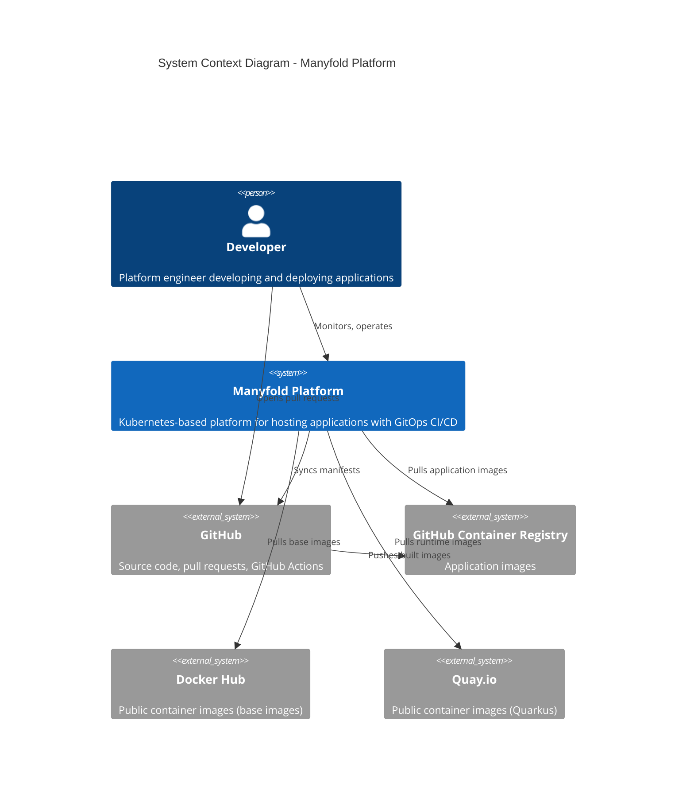
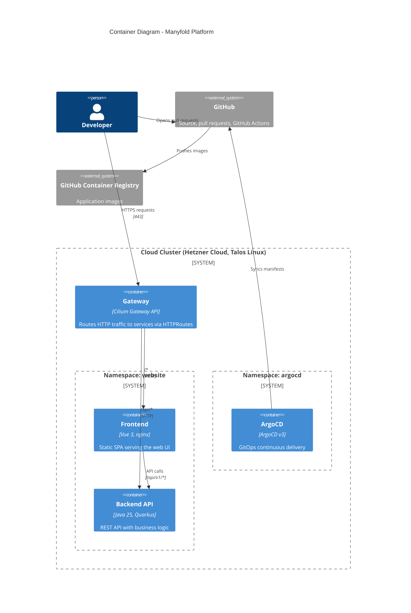
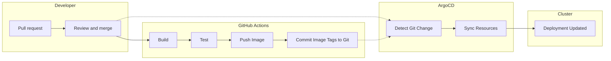
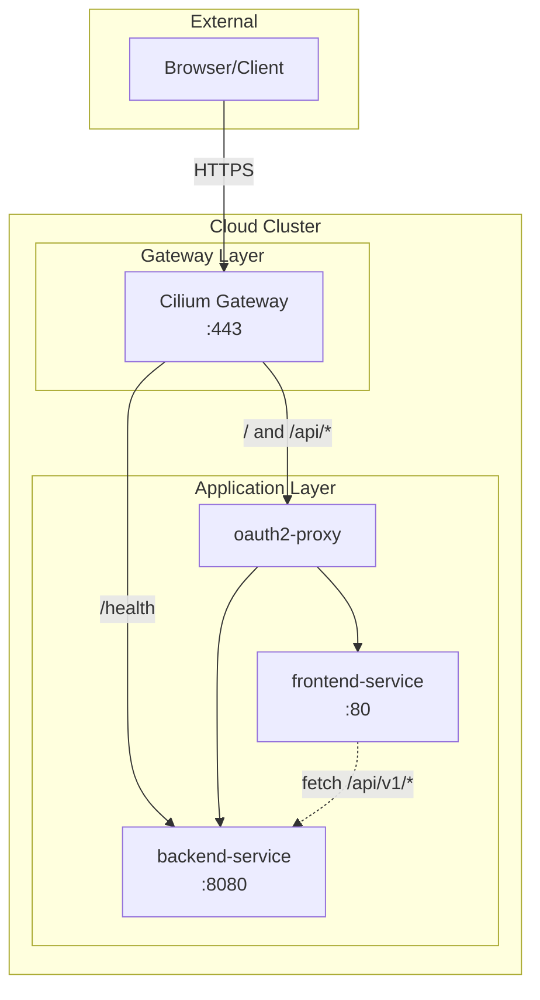
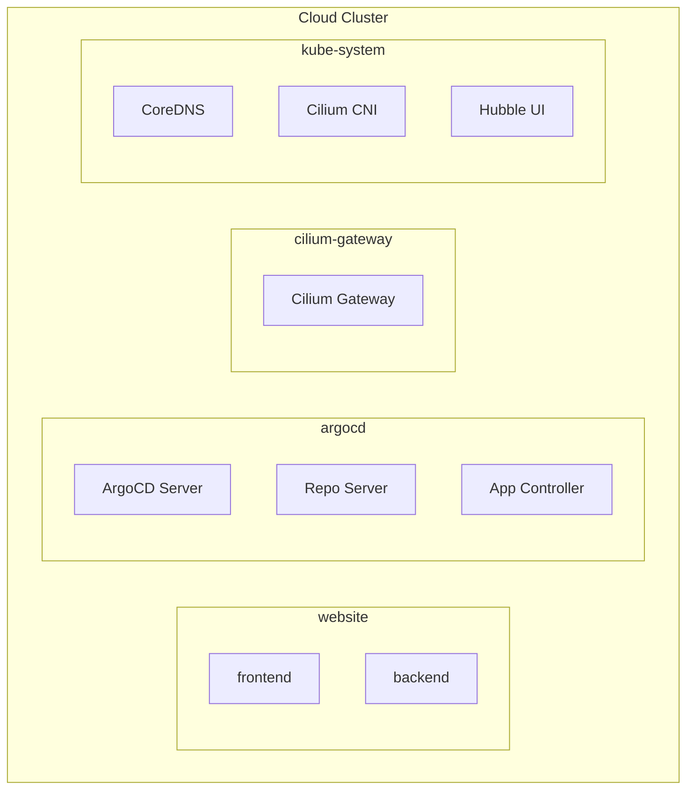
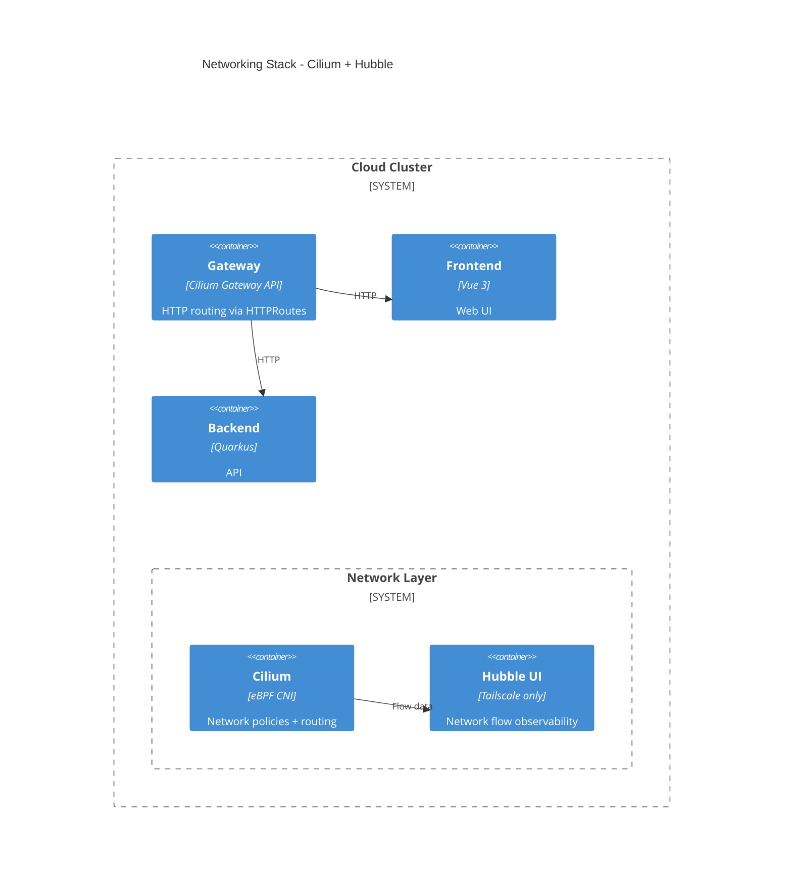

# Platform Architecture

Architecture diagrams for the Manyfold Platform using the C4 model.

The platform runs on one cluster, the cloud cluster (Hetzner Cloud, Talos Linux). The local kind
cluster that earlier versions of these diagrams showed was retired on 2026-09-27 (see
[ADR-0054's amendment of 2026-09-27](../adr/0054-public-platform-and-private-instance-repositories.md#amendment-2026-09-27-no-demo-tree-throwaway-cloud-instances-instead)).

## Table of Contents

- [C4 Model Overview](#c4-model-overview)
- [Level 1: System Context](#level-1-system-context)
- [Level 2: Container Diagram](#level-2-container-diagram)
- [GitOps Deployment Flow](#gitops-deployment-flow)
- [Network Flow](#network-flow)
- [Namespace Organization](#namespace-organization)
- [Current Networking Stack](#current-networking-stack)
- [Observability Stack](#observability-stack)
- [Cloud Architecture](#cloud-architecture)
- [Related Documentation](#related-documentation)

## C4 Model Overview

The C4 model provides four levels of abstraction:
1. **Context** - System scope and external dependencies
2. **Container** - High-level technical building blocks
3. **Component** - Internal structure of containers (future)
4. **Code** - Implementation details (future)

---

## Level 1: System Context

Shows the Manyfold Platform and its interactions with users and external systems.



### Context Description

| Actor/System | Description |
|--------------|-------------|
| **Developer** | Platform engineer who develops applications and manages the platform |
| **Manyfold Platform** | The cloud Kubernetes cluster with GitOps delivery |
| **GitHub** | Hosts source code and pull requests; GitHub Actions builds and tests the application images; ArgoCD syncs manifests from here |
| **GitHub Container Registry** | Stores the application images that GitHub Actions builds |
| **Docker Hub** | Source for base images (Maven, Node.js, Alpine, nginx) |
| **Quay.io** | Source for runtime images (Quarkus) |

---

## Level 2: Container Diagram

Shows the major technical building blocks within the platform.



### Container Descriptions

| Container | Technology | Purpose |
|-----------|------------|---------|
| **Gateway** | Cilium Gateway API | Routes external HTTP traffic to internal services via HTTPRoutes |
| **Frontend** | Vue 3 + nginx | Single-page application serving the web interface |
| **Backend API** | Java 25 + Quarkus | REST API providing business logic and data access |
| **ArgoCD** | ArgoCD v3 | GitOps controller that syncs Kubernetes manifests from Git |
| **GitHub Actions** | `*-blacksmith.yml` workflows | Builds and tests the application images, pushes them to GitHub Container Registry, commits the new image tags |

---

## GitOps Deployment Flow

The platform uses a pure GitOps approach for deployments:



Before the merge, the render harness (`scripts/ci/render-apps.py`, a render before and after the
change, then `--compare`) and the per-application tests prove a change; after the merge, ArgoCD
deploys it to the cloud cluster.

This provides a full audit trail in Git history - every deployment is traceable to a specific commit.

---

## Network Flow

How HTTP requests flow through the system:



---

## Namespace Organization



---

## Current Networking Stack

The platform uses Cilium for networking with Hubble for observability:



## Observability Stack

The platform includes a complete observability stack deployed via ArgoCD:

| Component | Purpose | Access |
|-----------|---------|--------|
| **Prometheus** | Metrics collection and alerting | `https://prometheus.<domain>` (cloud) |
| **Grafana** | Dashboards and visualization | `https://grafana.<domain>` (cloud) |
| **Alertmanager** | Alert routing and notifications | `https://alertmanager.<domain>` (cloud) |
| **Loki** | Log aggregation | Via Grafana Explore |
| **Tempo** | Distributed tracing | Via Grafana Explore |
| **Alloy** | Log and trace collection (DaemonSet) | Internal |

See [ADR-0013](../adr/0013-observability-stack.md) for architecture decisions.

---

## Cloud Architecture

The production environment runs on Hetzner Cloud with Talos Linux:

```
Hetzner Cloud (one EU location)
├── 3× small Control Plane nodes (Talos Linux)
│   └── etcd, API server, scheduler, controller-manager
├── 2× small Worker nodes (Talos Linux)
│   └── Application workloads
├── Load Balancer
│   └── Kubernetes API (6443)
├── Private Network (the configured network CIDR)
└── Cloudflare DNS (<domain>)
```

### Cloud Components

| Component | Purpose |
|-----------|---------|
| **Talos Linux** | Immutable, API-driven Kubernetes OS |
| **Cilium** | CNI with eBPF networking |
| **Hetzner CCM** | Cloud Controller Manager for LB integration |
| **Hetzner CSI** | Persistent volume provisioning |
| **ArgoCD** | GitOps deployment with KSOPS for secrets |
| **External-DNS** | Automatic DNS record management |
| **Cert-Manager** | TLS certificate automation |

### Cloud Endpoints

| Service | URL |
|---------|-----|
| Website | `https://<domain>` |
| ArgoCD | `https://argocd.<domain>` |
| Grafana | `https://grafana.<domain>` |
| Prometheus | `https://prometheus.<domain>` |
| Hubble | `https://hubble.<domain>` |

`<domain>` is the installation's domain. The server types, the location, the network CIDR and
the other configured values are the installation's own; the cloud cluster's infrastructure notes
in the instance repository hold them.

---

## Related Documentation

- [ADR-0001: Monorepo Structure](../adr/0001-monorepo-structure.md)
- [ADR-0005: ArgoCD/Crossplane Split](../adr/0005-argocd-crossplane-responsibility-split.md)
- [ADR-0006: CI/CD Tooling Selection](../adr/0006-cicd-tooling-selection.md)
- [ADR-0014: Cloud Provider Selection](../adr/0014-cloud-provider-selection.md)
- [ADR-0015: Kubernetes Distribution](../adr/0015-kubernetes-distribution.md)
- Cloud infrastructure notes: the cloud cluster's configuration, kept in the instance repository
- [Operational Runbooks](../runbooks/)
